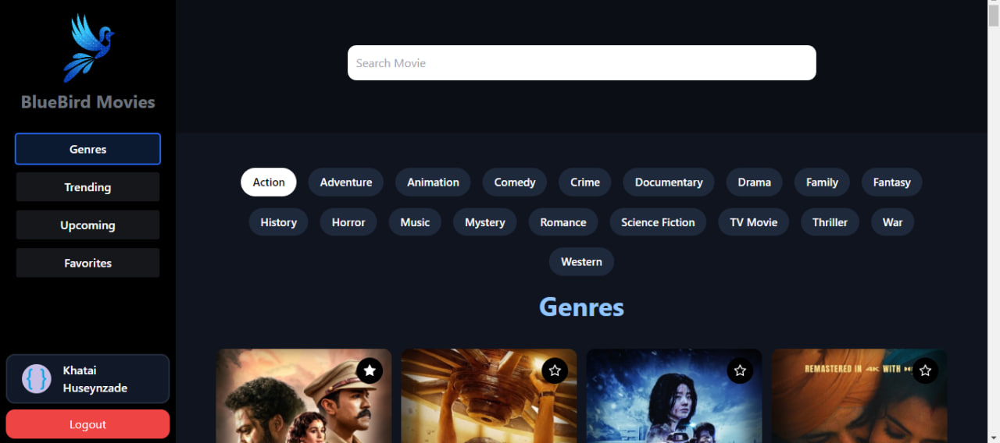
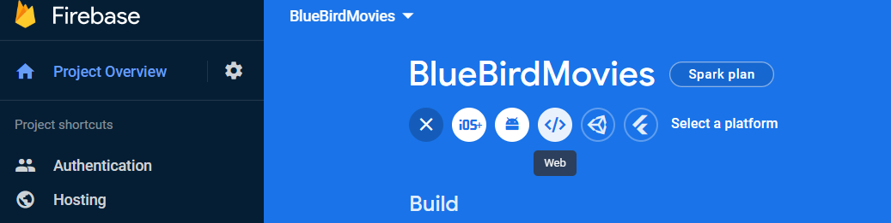
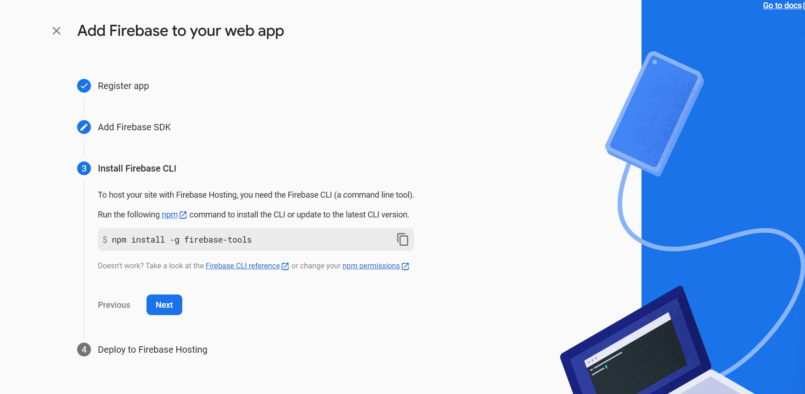
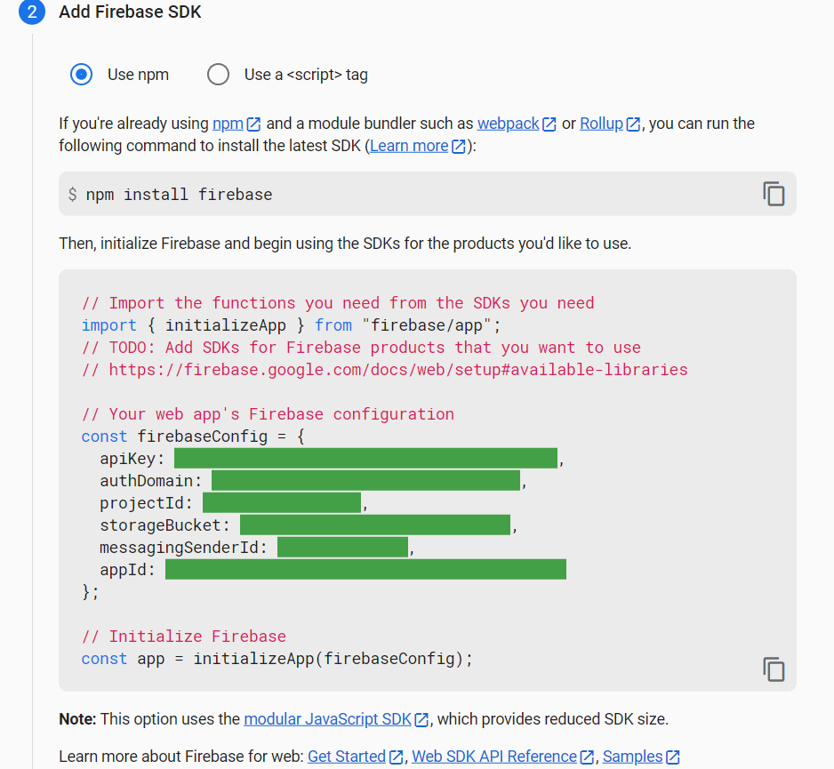
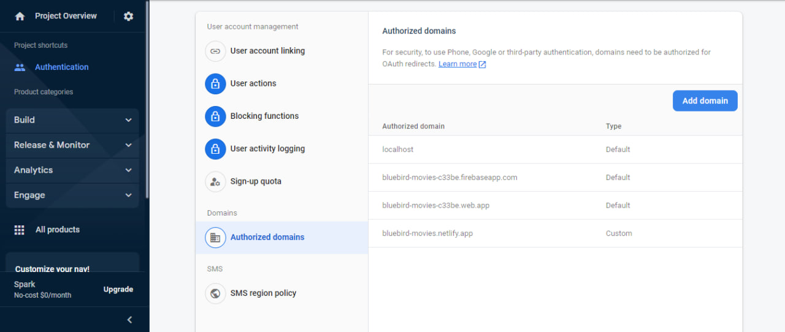

<h1 align="center">BlueBird Movies</h1>
BlueBird Movies is a React-based movie website that allows users to search for movies by title, sort them by genre, view trending and upcoming movies, and bookmark their favorite movies. The website is designed to be user-friendly and visually appealing.

<h2> 🍿 Features </h2>
<ul>
<li>Search and watch movies: users can search for movies by title and can watch them easily</li>
<li>Genre-wise display: movies can be sorted by genre</li>
<li>Trending Movies: displays a section for trending movies</li>
<li>Upcoming movies: displays a section for upcoming movies</li>
<li>Movie Details: users can view detailed information about each movie</li>
<li>Bookmark Movies: users can bookmark their favorite movies for later viewing</li>
<li>Google Authentication: users can sign in using their Google account</li>
</ul>

<h2> 🍿 Technology </h2>

BlueBird Movies is built using the following technologies:

<ul>
<li>ReactJS</li>
<li>TMDB API</li>
<li>Firebase Google Authentication</li>
<li>Framer Motion</li>
</ul>

<h1> 🍿 How to Run the Website on Your System</h1>
<h2>Step 1: Download and Extract the Code</h2>

Firstly, download the entire website code and extract the ZIP file to a folder on your local system.

<h2>Step 2: Obtain the TMDB Movies API Key and Firebase Configuration</h2>

Before starting the website, you will need to obtain the TMDB Movies API key and Firebase configuration. Follow these steps to obtain them and add them to your <code>.env</code> file.

<h3> ▶️ Get TMDB API Key</h3>

 Go to <a href="https://www.themoviedb.org/" target="_blank">https://www.themoviedb.org/</a> and log in.
 

 - Click on your user profile picture in the navigation bar, and select "Settings".
 

 - In the settings, select "API" and generate an API key.

<h3> ▶️ Firebase Setup</h3>

Note that Firebase is only required for Google authentication. If you are not using Google authentication in your application, you can skip this step. 

 - Go to the Firebase Console and create a new app. 

 - After creating the app, build a web app by clicking "Add App" and following the instructions. 

 - Copy the configuration information provided in the green line, and paste it into the `.env` file:

 - Next, to activate Google authentication in Firebase, go to <h2>Build > Authentication</h2> and enable Google authentication.

<h2>Step 3: Run the Website</h2>

Open your code editor (such as VS Code) and navigate to the project directory. Then, open a terminal and run the following command:

<pre><code>npm run dev</code></pre>

This will start the application. Open a web browser and navigate to <a href="http://localhost:5173" target="_blank">http://localhost:5173</a> to access the website.

Note: Ensure that you have carefully added the TMDB API key and Firebase authentication configuration to your <code>.env</code> file. If the <code>.env</code> file is not working, add all the API keys and configuration manually.

<h1> 🍿 Demo</h1>

Check out our live demo at https://moviesbluebird.netlify.app/ 

